# labspy05
# latihan
# Latihan yang pertama adalah membuat daftar kontak dengan menggunakan dictionary pada python
berikut input nya

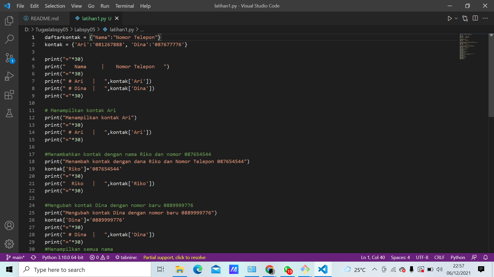


Dengan penjelasan source code sebagai berikut:

-Dibawah ini adalah untuk menampung data dari dictionary

```python
daftarkontak = {"Nama":"Nomor Telepon"}
kontak = {'Ari':'081267888', 'Dina':'087677776'}
```


-Sedangkan code dibawah adalah untuk mengakses atau menampilkan kontak yang telah ditampung dalam data dictionary tersebut

```python
print("="*30)
print("   Nama     |    Nomor Telepon   ")
print("="*30)
print(" # Ari   |   ",kontak['Ari'])
print(" # Dina  |   ",kontak['Dina'])
print("="*30)
```

 # hasil output nya
 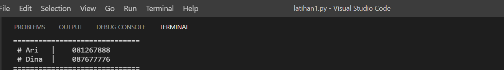

-Code dibawah ini adalah untuk menampilkan salah satu dari daftar kontak yang ada, dibawah yang akan di tampilkan adalah daftar kontak Ari
```python
print("Menampilkan kontak Ari")
print("="*30)
print(" # Ari   |   ",kontak['Ari'])
print("="*30)
```

# hasil output nya
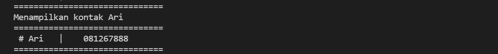

-Code dibawah ini untuk menambahkan kontak dengan nama Riko dan nomor 087654544
```python
print("Menambah kontak dengan dana Riko dan Nomor Telepon 087654544")
kontak['Riko']='087654544'
print("="*30)
print("  Riko   |   ",kontak['Riko'])
print("="*30)
```

# hasil output nya
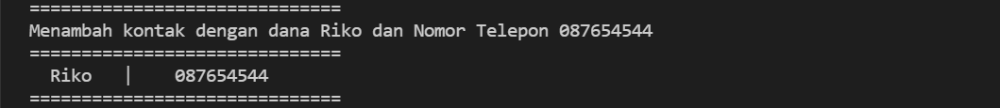

-Code dibawah untuk mengubah kontak Dina dengan nomor baru 0889999776
```python
print("Mengubah kontak Dina dengan nomor baru 0889999776")
kontak['Dina']='0889999776'
print("="*30)
print(" # Dina  |   ",kontak['Dina'])
print("="*30)
```

# hasil output nya
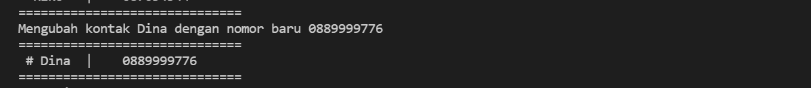

-Code dibawah untuk menampilkan semua nama yang ada dalam daftar kontak
```python
print("Menampilkan semua nama")
print("="*30)
print(kontak.keys())
print("="*30)
```

# hasil output nya
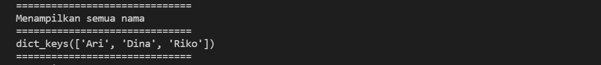

-Code berikut untuk menampilkan semua nomor yang ada dalam daftar kontak
```python
print("Menampilkan semua nomor")
print("="*30)
print(kontak.values())
print("="*30)
```

# hasil output nya
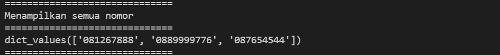

-Code berikut untuk menampilkan semua daftar kontak beserta nama dan nomornya
```python
print("Menampilkan daftar nama dan nomor")
print("="*30)
print(kontak.items())
print("="*30)
```

# hasil output nya
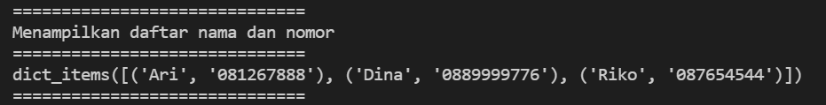

-Code dibawah untuk menghapus kontak Dina yang tersimpan dalam daftar kontak
```python
print("Hapus kontak Dina")
kontak.pop('Dina')
print("="*30)
print(kontak.items())
print("="*30)
```
# hasil output nya
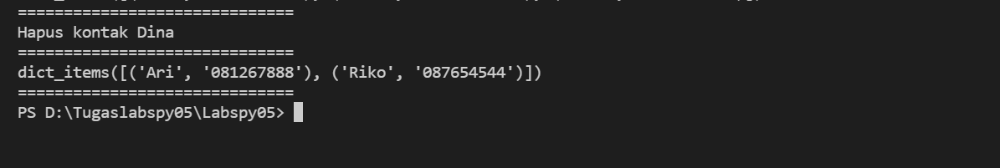

# pratikum05
### A. Program

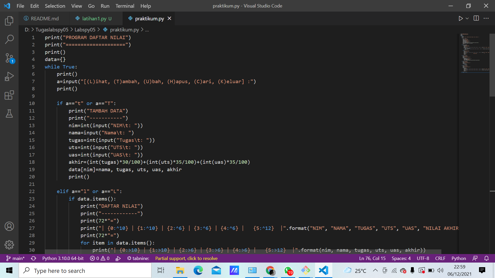

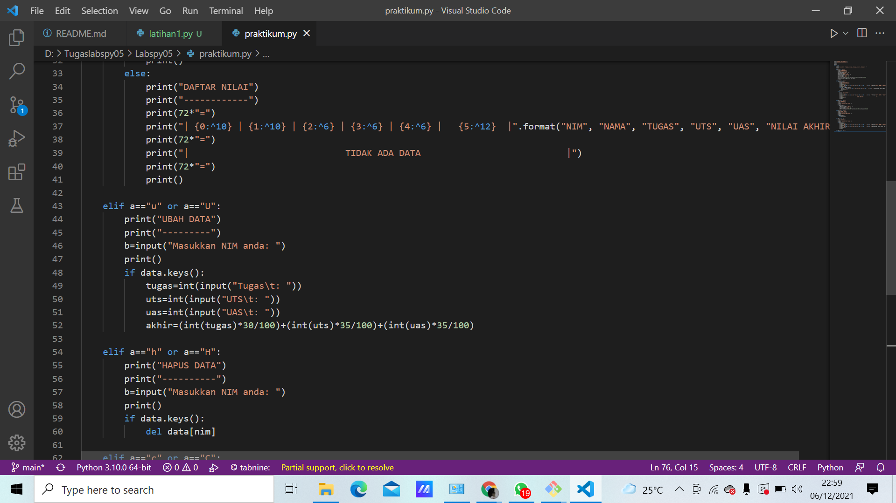

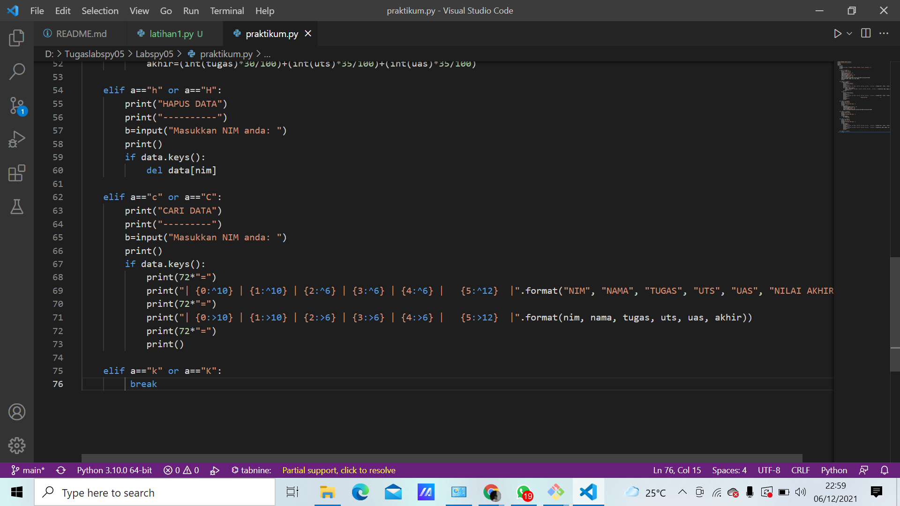


### C. Penjelasan

1. Membuat dictionary kosong yang nantinya akan diinput dengan data.
	```python
	data={}
	```

2. Membuat perulangan dengan _while_ dan terdapat pilihan menu untuk menjalankan program.
	```python
	while True:
    print()
    a=input("[(L)ihat, (T)ambah, (U)bah, (H)apus, (C)ari, (K)eluar] :")
    print()
	```
3. Menambahkan data nim, nama, nilai tugas, uts, dan uas. Data yang diinputkan akan masuk ke dalam dictionary **data** dengan **nim** sebagai keys sedangkan nama, tugas, uts dan uas sebagai **values**.
	```python
	if a=="t" or a=="T":
        print("TAMBAH DATA")
        print("-----------")
        nim=int(input("NIM\t: "))
        nama=input("Nama\t: ")
        tugas=int(input("Tugas\t: ")) 
        uts=int(input("UTS\t: "))
        uas=int(input("UAS\t: "))
        akhir=(int(tugas)*30/100)+(int(uts)*35/100)+(int(uas)*35/100)
        data[nim]=nama, tugas, uts, uas, akhir
	```
4. Menampilkan atau melihat data. Jika sebelumnya belum menginput data, maka tampilannya akan "Tidak ada data". Apabila sudah menginput data, maka data yang telah diinput tadi akan ditampilkan.
	```python
	elif a=="l" or a=="L":
        if data.items():
            print("DAFTAR NILAI")
            print("------------")
            print(72*"=")
            print("| {0:^10} | {1:^10} | {2:^6} | {3:^6} | {4:^6} |   {5:^12}  |".format("NIM", "NAMA", "TUGAS", "UTS", "UAS", "NILAI AKHIR"))
            print(72*"=")
            for item in data.items(): 
                print("| {0:>10} | {1:>10} | {2:>6} | {3:>6} | {4:>6} |   {5:>12}  |".format(nim, nama, tugas, uts, uas, akhir))
                print(72*"=")
            print()
        else:
            print("DAFTAR NILAI")
            print("------------")
            print(72*"=")
            print("| {0:^10} | {1:^10} | {2:^6} | {3:^6} | {4:^6} |   {5:^12}  |".format("NIM", "NAMA", "TUGAS", "UTS", "UAS", "NILAI AKHIR"))
            print(72*"=")
            print("|                             TIDAK ADA DATA                           |")
            print(72*"=")
            print()
	```
5. Apabila ingin mengubah data, maka anda akan diminta untuk menginputkan **nim** terlebih dahulu. Setelah itu input data yang ingin diubah.
	```python
	 elif a=="u" or a=="U":
        print("UBAH DATA")
        print("---------")
        b=input("Masukkan NIM anda: ")
        print()
        if data.keys():
            tugas=int(input("Tugas\t: ")) 
            uts=int(input("UTS\t: "))
            uas=int(input("UAS\t: "))
            akhir=(int(tugas)*30/100)+(int(uts)*35/100)+(int(uas)*35/100)
	```
6. Jika ingin menghapus data, anda akan diminta untuk menginput **nim**. Lalu data yang telah diinput diawal tadi akan dihapus beserta valuesnya (nama, nilai tugas, nilai uts dan nilai uas).
	```python
	elif a=="h" or a=="H":
        print("HAPUS DATA")
        print("----------")
        b=input("Masukkan NIM anda: ")
        print()
        if data.keys():
            del data[nim]
	```
7. Apabila ingin mencari data, anda akan diminta untuk menginput **nim** kemudian data yang anda cari akan muncul berdasarkan nim yang diinput tadi.
	```python
	elif a=="c" or a=="C":
        print("CARI DATA")
        print("---------")
        b=input("Masukkan NIM anda: ")
        print()
        if data.keys():
            print(72*"=")
            print("| {0:^10} | {1:^10} | {2:^6} | {3:^6} | {4:^6} |   {5:^12}  |".format("NIM", "NAMA", "TUGAS", "UTS", "UAS", "NILAI AKHIR"))
            print(72*"=")
            print("| {0:>10} | {1:>10} | {2:>6} | {3:>6} | {4:>6} |   {5:>12}  |".format(nim, nama, tugas, uts, uas, akhir))
            print(72*"=")
            print()
	```
8. Jika data sudah selesai diinput, pilih menu **'k'/'K'** maka program akan terhenti.
	```python
	elif a=="k" or a=="K":
         break
	```
### D. Output


### Sekian Terimakasih